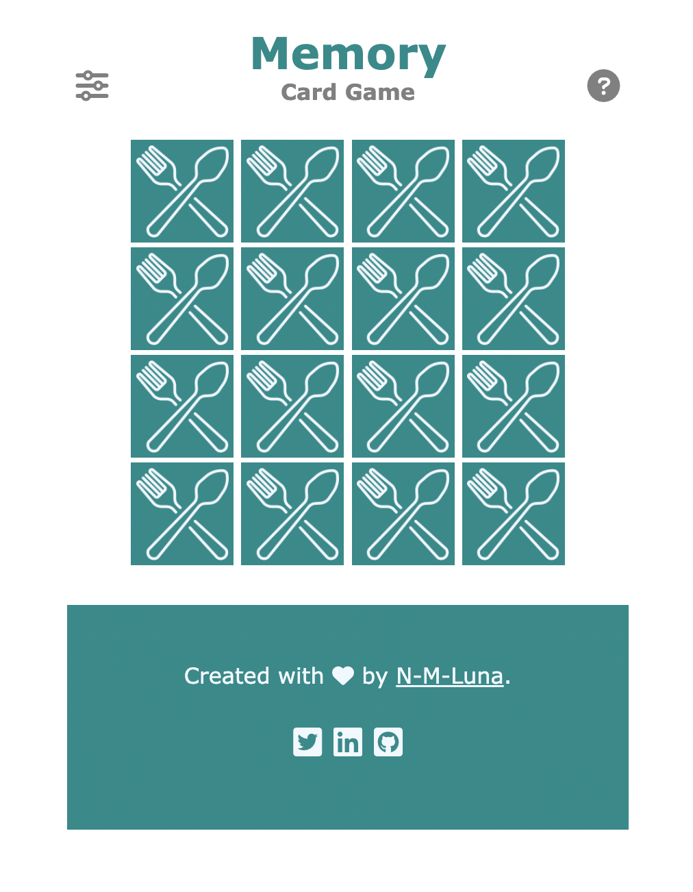

# Plans for Match Match (card game)

## Elevator pitch

To play this card game, a deck of cards is spread out and laid face down. The player (or players) take turns in flipping two cards face up. The goal is to find the matching pairs of cards. 

This game is also known as *Memory, Concentration, Matching Pairs*, or *Match Up*. Here is the [Wikipedia article](https://en.wikipedia.org/wiki/Concentration_(card_game)) on this game.

Last year, I implemented a 1-player version of this game using vanilla HTML, CSS, and JS. Here is my [GH repo](https://github.com/N-M-Luna/memory-card-game) and here is the [single-page app](https://n-m-luna.github.io/memory-card-game/). For my final project, I'd like to re-make this app using React; or *reactify my app*, if you will.

## Features (with wireframes)

The game starts by shuffling and dealing a deck of 16 card (8 pairs of identical cards) face-down on the game board.

 

> Beginning of game

In each turn, the player flips two cards. If they match, the player has solved the pair of cards and they remain facing up. If the cards do not match, they get flipped over again.

https://user-images.githubusercontent.com/1752105/188282009-b124bf38-0c62-4725-b406-e4e9c7df6fae.mov

> Game play

The game ends when all the cards have been solved.

> End of game

In the top left corner, there is a settings button that opens a **deck menu**. This allows the player to change the deck. *The deck library consists of six decks with the following themes: food, camping, animals, science, household, and tech.*

> Deck menu

In the top right coner, there is a help button that opens a **help screen** with the rules of the game.

> Game rules

### Nice-to-have features

If my app can do everything desribed in the previous section (before the project is due), I would like to implement the following features.

* User can change levels. 
* Browser remembers highest score. 
* User can sign in to keep a record of their highest score.

## Dependencies

Will not be using any external npm modules. Will be using React, *of course*. In particular, will use `useState` to keep track of the number of turns the user has played, which cards have been solved, and which cards are in the current turn. Depending on the complexity of the app, I might use `Routes` to change between the welcome/log-in route, the game route, and the game-over route.

For layout and style, I *might* use Bootstrap. If authentication is being implemented, will use firebase.

## Game plan

1. Make a first draft. 

   1. Make a react app that has a `<GameBoard>` component with 16 `<Card>` components. The card's back will be an `` and the card face will be one of eight different font awesome icons.
   2. Whenever the user clicks on a card, it flips over.
   3. Use JavaScript to "shuffle the cards" when the app starts.

2. Implement game logic. 

   1. After the user clicks on two cards, we need to count the turn and then one of two things happen. Either the cards match and we update the status of those two cards as "solved"; or they don't match and we flip them back.
   2. When all the cards in the deck have been solved, send an alert with the player's score.

3. Use `Routes` to add a start game route and a game over route. The start game route is just a button to start the game. And the game over route displays the player's score (i.e., number of turns) and has a button to play again.

4. Make a deck menu where the player can change between decks.

5. Add in the extras.

   1. Social icons in the footer.
   2. User can change levels. 
   3. Browser remembers highest score. 
   4. User can sign in to keep a record of their highest score.
   5. User can share their score in social media.